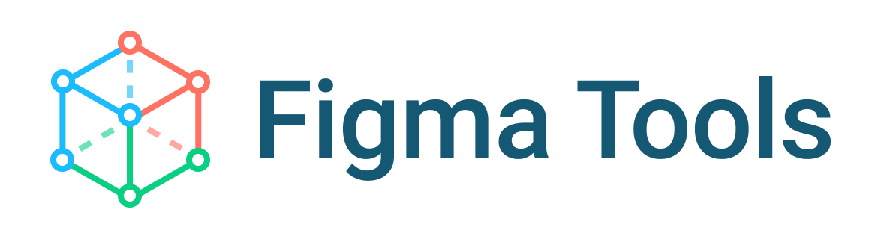

<p align="center">
  
</p>

<p align="center">
  Tools to help you programmatically interact with your Figma files.
</p>

## Install

```
npm install figma-tools --dev
```

## Exports

<em>Please note: you must include a
<a href="https://www.figma.com/developers/docs#auth-dev-token">personal access token</a> in
a `.env` at the root of your project or as an environment variable in order for the following functions to work.
</em>

```env
FIGMA_TOKEN=personal-token-here
```

You must also import and initiate the `dotenv` package in order to load the `.env` file:

```js
const dotenv = require('dotenv')
const { fetchImages } = require('figma-tools')

dotenv.config()

fetchImages({
  fileId: 'E6didZF0rpPf8piANHABDZ',
  format: 'jpg',
}).then((images) => {
  ...
})
```

### fetchImages: ([ImageOptions](#imageoptions)) => Promise<Array<[Image](#image)>>

Fetch components in a file and export them as images.

### fetchStyles: (fileId: string) => DocumentStyles

Fetch library styles used in a file.

### watchFile (fileId: string, callback: (file: FileResponse, previousFile: FileResponse) => void, delay: number = 5000)

Watch a file for changes.

### diffFiles (fileA: FileResponse, fileB: FileResponse)

Determine the differences between two files. Uses a simple wrapper around [jest-diff](https://github.com/facebook/jest/tree/main/packages/jest-diff#jest-diff).

## Types

### ImageOptions

#### fileId

#### filter

#### [image params](https://jongold.github.io/figma-js/interfaces/fileimageparams.html)

### Image

#### name

#### description

#### buffer

#### pageName

#### frameName

#### groupName

## Usage

Once your token has been set you can use any of the provided functions in a Node script. In a simple example, we will create an `icons.js` file:

```jsx
const { fetchImages } = require('figma-tools')

fetchImages({
  fileId: 'E6didZF0rpPf8piANHABDZ',
  format: 'jpg',
}).then((images) => {
  console.log(images)
})
```

Now we can call our function and fetch images from our Figma file 💰:

```bash
node icons.js
```

It's that easy! This script can hook into a build script or be used in conjunction with the `watchFile` function whenever you need to refresh your assets.

## Recipes

### JPG, PNG, SVG, or PDF

```js
const fs = require('fs')
const { fetchImages } = require('figma-tools')

fetchImages({
  fileId: 'E6didZF0rpPf8piANHABDZ',
  format: 'jpg',
}).then((images) => {
  images.forEach((image) => {
    fs.writeFileSync(path.resolve(`${image.name}.jpg`), image.buffer)
  })
})
```

### React Components

```js
const fs = require('fs')
const path = require('path')
const svgtojsx = require('svg-to-jsx')
const { pascalCase } = require('case-anything')
const { fetchImages } = require('figma-tools')

fetchImages({
  fileId: 'E6didZF0rpPf8piANHABDZ',
  format: 'svg',
}).then(async (svgs) => {
  const jsx = await Promise.all(svgs.map((svg) => svgtojsx(svg.buffer)))
  const data = svgs
    .map((svg, index) => {
      return `export const ${pascalCase(svg.name)} = () => ${jsx[index]}`
    })
    .join('\n')
  fs.writeFileSync(path.resolve('icons.js'), data)
})
```

### JSON

```js
const fs = require('fs')
const path = require('path')
const { parse } = require('svgson')
const { fetchImages } = require('figma-tools')

fetchImages({
  fileId: 'E6didZF0rpPf8piANHABDZ',
  format: 'svg',
}).then(async (svgs) => {
  const json = await Promise.all(
    svgs.map((svg) => parse(svg.buffer.toString()))
  )
  const data = svgs.reduce(
    (data, svg, index) => ({
      ...data,
      [svg.name]: json[index],
    }),
    {}
  )
  fs.writeFileSync(path.resolve('icons.json'), JSON.stringify(data, null, 2))
})
```
